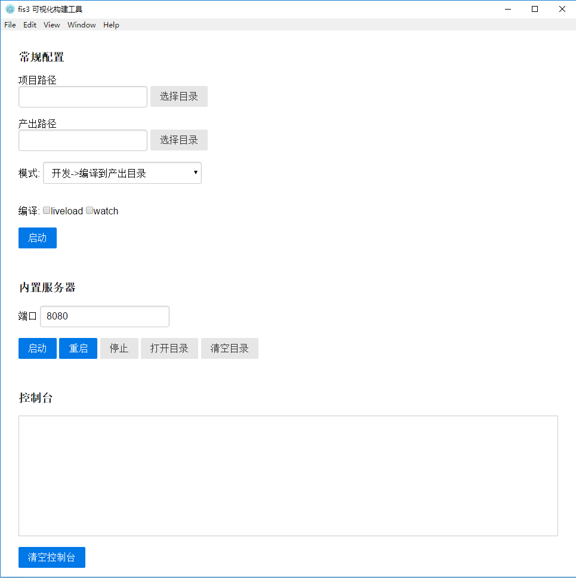

## 可视化fis3构建工具

内置常用fis3配置
- babel 编译
- less 编译
- sass 编译(依赖ruby)
- 样式压缩
- js压缩
- 图片压缩
- 雪碧图
- commonjs模块

### 相关命令

    安装 (后续提供exe)
    npm i
    运行
    npm start

### 模式

开发->编译内置服务

开发->编译产出路径

    执行任务列表:
        babel 编译
        less 编译
        sass 编译
        commonjs模块
    不执行任务列表:
        不生成雪碧图
        样式压缩
        js压缩
        图片压缩
    模式区别:
        输出路径不一致

发布->编译产出路径

静态资源->编译产出路径

    执行任务列表:
        babel 编译
        less 编译
        sass 编译
        commonjs模块
        不生成雪碧图
        样式压缩
        js压缩
        图片压缩
    模式区别:
        静态资源不会产出 view 路径下的 html

### commonjs模块
模块请放在 module文件夹当中

### 编译忽略文件
_前缀的文件夹与文件 ,node_modules下的文件,全部md文件

    demo
    | _demo  //文件夹下全部不产出
    |   |css
    |
    | _a.css //_前缀不产出 

### 文件嵌入资源

[嵌入资源](http://fis.baidu.com/fis3/docs/user-dev/inline.html)
